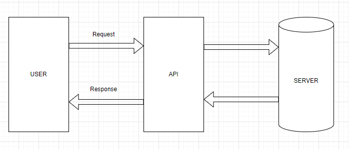

# APIs

## What are APIs? Why are they popular?
An API stands for **Application Programming Interface**. They are mechanisms that allow two software components to communicate with each other **using a set of definitions and protocols**. APIs are very popular as they allow for:
1) **Integration** - Allowing different software systems to communicate and interact
2) **Efficiency** - Save time and effort for developers as they provide pre-built functions
3) **Flexibility** - Allow developers to provide solutions in many different ways
4) **Accessibility** - Providing a standardised interface for anyone to use

## API Communication Diagram

## What is a REST API? What makes a API RESTful?
REST is a set of **architectural constraints**, that are not protocols or a standard. it relies on a **stateless protocol such as HTTP**. Restful APIs are designed to be **scalable and easily maintainable**. Restful APIs follow a client-server architecture where the client server are separate and communicate over a stateless protocol. This allows improves scalability, but allowing clients or servers to evolve independently.

### Guidelines on Rest APIs
Here  are a few guidelines on creating and using Rest APIs:
*  Should accept and respond with JSON, for requests and responses
*  Use nouns instead of verbs in endpoint paths - as the HTTP request method already uses a verb
* Use logical nesting on endpoints - Good practice you should design objects to reflect endpoints
* Good error handling with meaningful messages - such as 400 Bad Request etc...
* Maintain good security practices
* Caching data to improve performance - Allow users to obtain data fast but the user can have outdated data
* Versioning - Support for backward compatibility, which allows future changes without breaking existing clients

## What is HTTP? What does it stand for? What is HTTPS?
HTTP is **HyperText Transfer Protocol**, and it is used to load webpages using hypertext links. It is an application layer protocol that is designed to transfer information between devices.
HTTPS is **HyperText Transfer Protocol Secure**. The difference between HTTP and HTTPS is that HTTPS is **encrypted and has verification**. It uses the **Secure Socket Layer** to encrypt HTTP requests and responses. Which is why HTTPS is used more than HTTP.

## HTTP Diagram : Request

 This is the HTTP Request diagram. The top layer contains Verb, URL and version. The verb specifics the type of request being made (GET, POST, PUT, DELETE). The URL specifics the location of the resource being requested. Version specifics the version of HTTP that is being used.

Moving on to the second layer, it contains the header, which is a series of key-value pairs that provide additional information about the request.

The body contains the optional data and is sent along with the request. The body contains text, JSON and XML data. Typically used with POST and PUT requests

## HTTP Diagram : Response

The response diagram is slightly different to the Request Diagram. At the top of the diagram we have response code and HTTP Version. The response code is usually a 3-digit code that indicates the outcome of the request (404 being request not found). HTTP version is the version of HTTP that is being used. The rest of the diagram is exactly the same as the request diagram.

## 5 HTTP Verbs
* **GET** - Requests data from a specific resource
* **POST** - Used to submit data to be processed to a specific resource
* **PUT** - Used to update or replace an existing resource with data provided in the request
* **DELETE** - Used to delete a specific resource from the server
* **PATCH** - Used to apply partial modifications to a resource

## WHat is Statelessness?

