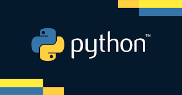

### What is Python? What is the history of Python?
* Python is a programming language.
* Designed by Guido van Rossum in 1991
* Was created to emphasis code **readability**
* allows programmers to **express concepts with fewer lines** 

### Why is Python popular? Why is it particularly popular for DevOps engineers?
* It is very **versatile**
* Very **flexible**, as you can use it in a variety of way such as data analysis or back end development
* Huge Library
* Good for DevOps as it can be used for **automating repetitive tasks**
### What is a virtual environment or venv?
* Allows to help keep dependencies (Libraries or Packages) **separated** from other projects
* This ensures there are no **conflicting** issues

### What is "PIP"?
* PIP is a Package manager for Python
* Allows you to install **libraries** such as Pygame or anything required for your project
```cmd
pip install pygame
```
### What is scripting? How is it different to programming?
* Having a specific task
* Usually written in languages that are easier to code in (**Pyhon, JavasScript etc...**)
* Usually used for smaller tasks
* Ideal for creating Dynamic Experiences
* Focus on Rapid developement and ease of use (**Automation**)
* Programming involves compiling languages for applications 

### What are the base python libraries?
1) **Os** - Operating system interfaces for interacting with the operating system.
2) **Sys** - System-specific parameters and functions.
3) **Math** - Mathematical functions and constants.
4) **Random** - Generate pseudo-random numbers.
5) **Datetime** - Manipulate dates and times.
6) **Re** - Regular expression operations.
7) **Json** - Encode and decode JSON data.
8) **Csv** - Read and write CSV files.
9) **Urllib** - URL handling modules.

### What are some of the most popular external libraries?
1) **TensorFlow** - High level computation and is used for machine learning
2) **Matplotlib** - Plotting numeric data
3) **Pandas** - Important for data scientists
4) **Numpy** - "Numerical Python", a machine learning library that supports large matrices
5) **SciPy** - Stores the numerical data code when used with Numpy
6) **Scrappy** - Extracts data from websites
7) **Scikit-learn** - Python Library for working with complex data
8) **PyGame** - Used to create basic games (Games Dev)
9) **PyTorch** - Largest machine learning library
10) **PyBrain** - Built for beginners in the field of machine learning
